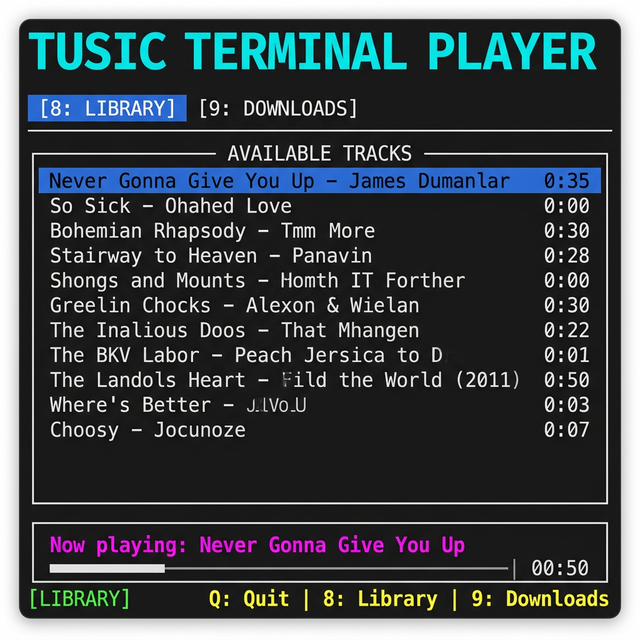

<p align="center">
  <h1 align="center">🎵 Tusic</h1>
  <p align="center">
    <strong>A terminal-based music player built with Java</strong>
  </p>
  <p align="center">
    <a href="#features">Features</a> •
    <a href="#screenshot">Screenshot</a> •
    <a href="#requirements">Requirements</a> •
    <a href="#installation">Installation</a> •
    <a href="#usage">Usage</a> •
    <a href="#architecture">Architecture</a> •
    <a href="#contributing">Contributing</a> •
    <a href="#license">License</a>
  </p>
  <p align="center">
    
    
    
    
  </p>
</p>

---

Tusic is a lightweight, keyboard-driven TUI (Text User Interface) music player that runs entirely in your terminal. Download tracks from YouTube, SoundCloud, and other platforms directly, manage your library, and play audio — all without leaving the command line.

## Screenshot

<p align="center">
  
</p>

## Features

| Feature | Description |
|---------|-------------|
| 🎧 **Audio Playback** | Play audio files using the bundled **mpv** player |
| ⬇️ **Download Tracks** | Download audio from YouTube, SoundCloud, and [700+ sites](https://github.com/yt-dlp/yt-dlp/blob/master/supportedsites.md) via **yt-dlp** |
| 📚 **Library Management** | Persistent song library backed by **SQLite** |
| ⌨️ **Keyboard-Driven** | Navigate entirely with keyboard shortcuts |
| 🖥️ **Cross-Platform** | Runs on **Linux** and **macOS** |
| 📦 **Self-Contained** | Bundles `mpv` and `yt-dlp` binaries — no system installs required |

## Requirements

- **Java 21** or higher ([download](https://adoptium.net/))
- **Maven 3.8+** (for building from source)

> [!NOTE]
> Tusic bundles its own `mpv` and `yt-dlp` binaries in the `bin/` directory. You do **not** need to install them separately.

## Installation

### Clone the repository

```bash
git clone https://github.com/meysaw/tusic.git
cd tusic
```

### Build the project

```bash
mvn clean package
```

This creates a fat JAR at `target/tusic-1.0-SNAPSHOT.jar` with all dependencies included.

### Set executable permissions

**Linux:**
```bash
chmod +x bin/linux/*
```

**macOS:**
```bash
chmod +x bin/mac/*
```

## Usage

### Quick start

**Linux:**
```bash
./run.sh
```

**macOS:**
```bash
./run-mac.sh
```

Or run the JAR directly:
```bash
java -jar target/tusic-1.0-SNAPSHOT.jar
```

### Keyboard Shortcuts

| Key | Action |
|-----|--------|
| `8` | Switch to **Library** view |
| `9` | Switch to **Downloads** view |
| `Tab` / `→` | Navigate between UI elements |
| `Enter` | Play selected track / Confirm action |
| `Q` | Quit the application |

### Downloading a Track

1. Press `9` to switch to the **Downloads** view
2. Paste a URL (YouTube, SoundCloud, etc.) into the **Source URL** field
3. Press `Tab` to navigate to the **DOWNLOAD** button and press `Enter`
4. The track will be downloaded, converted to MP3, and added to your library

## Architecture

```
tusic/
├── src/main/java/com/tusic/
│   ├── App.java           # Main entry point & TUI layout (Lanterna)
│   ├── Player.java        # Audio playback controller (mpv)
│   ├── YTDLHelper.java    # Download manager (yt-dlp)
│   └── DBHelper.java      # SQLite database layer
├── bin/
│   ├── linux/             # Linux binaries (mpv, yt-dlp)
│   └── mac/               # macOS binaries (mpv, yt-dlp)
├── downloads/             # Downloaded audio files (git-ignored)
├── run.sh                 # Linux launch script
├── run-mac.sh             # macOS launch script
└── pom.xml                # Maven build configuration
```

### Tech Stack

| Component | Technology |
|-----------|-----------|
| TUI Framework | [Lanterna 3.1](https://github.com/mabe02/lanterna) |
| Audio Playback | [mpv](https://mpv.io/) (bundled) |
| Audio Download | [yt-dlp](https://github.com/yt-dlp/yt-dlp) (bundled) |
| Database | [SQLite](https://www.sqlite.org/) via JDBC |
| Build Tool | [Apache Maven](https://maven.apache.org/) |

## Contributing

Contributions are welcome! Please see [CONTRIBUTING.md](CONTRIBUTING.md) for guidelines.

1. Fork the repository
2. Create a feature branch (`git checkout -b feature/amazing-feature`)
3. Commit your changes (`git commit -m 'Add amazing feature'`)
4. Push to the branch (`git push origin feature/amazing-feature`)
5. Open a Pull Request

## License

This project is licensed under the MIT License — see the [LICENSE](LICENSE) file for details.

---

<p align="center">
  Made with ❤️ by <a href="https://github.com/meysaw">Meysaw</a>
</p>
